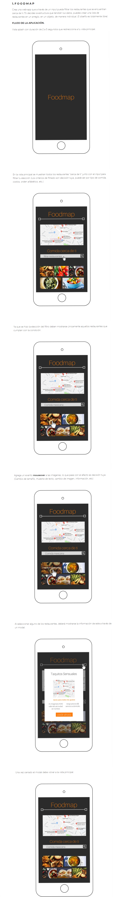

# Foodmap

## Programa: Realizar una web-app

**Descripción del proyecto:**
Hacer un filtro de restaurantes cercanos.

**Herramientas que se utilizaron:**

* HTML.
* CSS.
* JS.
* jQuery.

**Objetivo del proyecto:**

